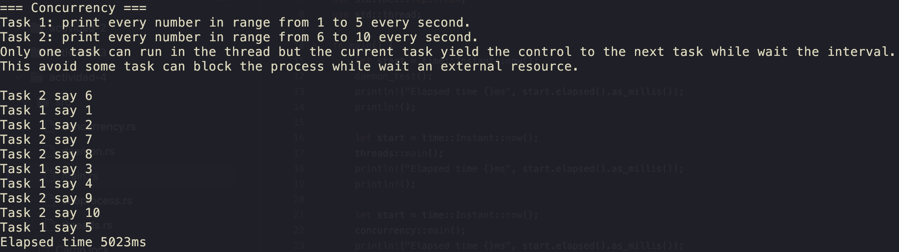
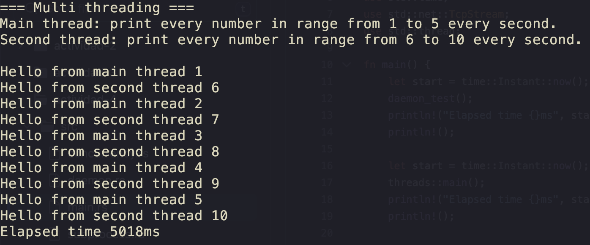
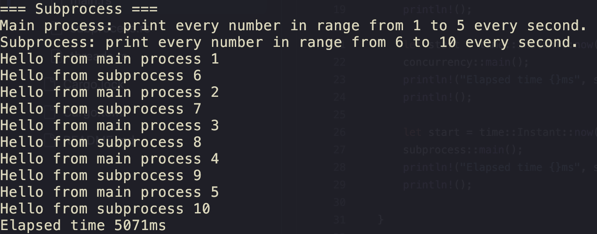
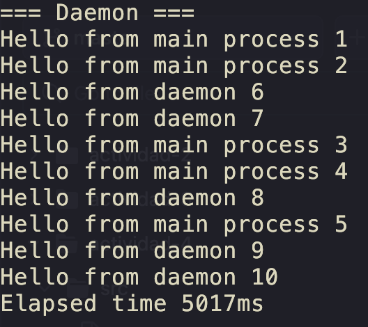

# How to run?

1. Run the daemon
  ```bash
  cargo run --bin daemon
  ```
2. Run the main program
  ```bash
  cargo run --bin main
  ```

## How to kill the daemon?
```bash
kill $(cat /tmp/daemon.pid)
```


## Examples








