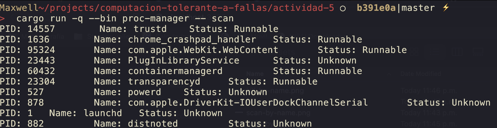

A little process manager with the following capabilities:
- List PID, name and status of processes (Allow usage of PID or process name).
- Kill processes by name or PID

# How to run?

1. Run the process manager
  ```bash
  cargo run --bin proc-manager -- <command> [<arg>]
  ```
2. Run the dummy process
  ```bash
  cargo run --bin dummy-process
  ```

## Requirements

- cargo
- rust

## How to scan

### All processes
```bash
cargo run --bin proc-manager -- scan
```



### Processes by name
```bash
cargo run --bin proc-manager -- scan dummy-process
```


### Process by pid
```bash
cargo run --bin proc-manager -- scan 123
````


### How to kill
### Processes by name
```bash
cargo run --bin proc-manager -- kill dummy-process
```


### Process by pid
```bash
cargo run --bin proc-manager -- kill 123
````


