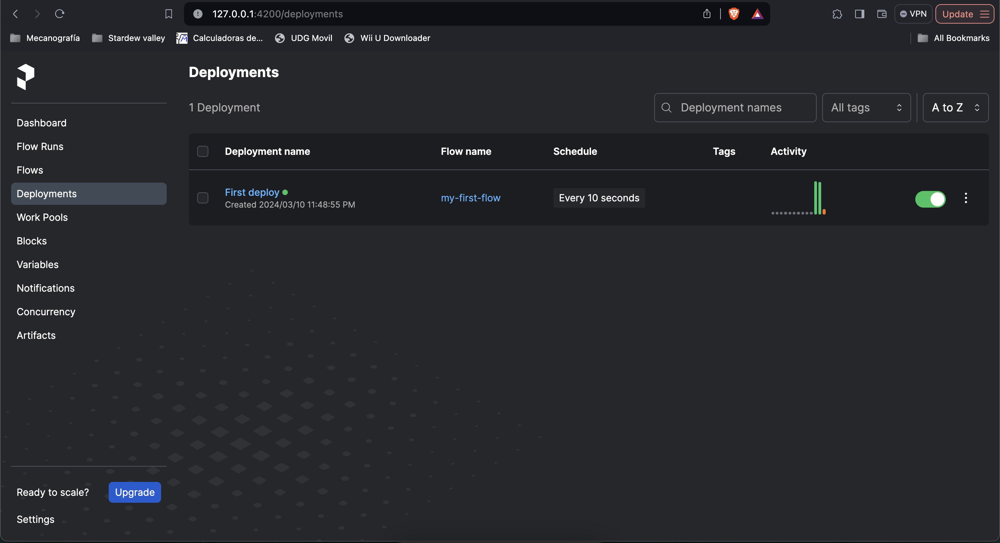

# Requisitos
- python3
- Prefect

# Como probar Prefect

1. Ejecutar Prefect localmente
  ```bash
  prefect server start
  ```

   

2. Configurar Prefect para usar el servidor local

  Configuramos la URL del API usando la obtenida en el paso anterior
  ```bash
  prefect config set PREFECT_API_URL=http://127.0.0.1:4200/api
  ```

3. Abrir el panel de Prefect

  Abrimos la URl que se indica durante el primer paso en el navegador

  

4. Servir el flujo de python usando Prefect

  ```bash
  python3 init.py
  ```

5. Visualizar el lanzamiento del flujo

  En el panel de Prefect en el navegador en la sección `Deployments` se puede visualizar el flujo que estamos servimos en el paso anterior el cuál podremos abrir para ver los detalles del mismo como las ejecuciones del flujo realizadas, pendientes y en proceso.

   

   

6. Visualizar detalles de flujo
  
  Si abrimos el detalle de la ejecucíon del flujo observar los registros, las tareas entre otra información de la ejecución.

   
